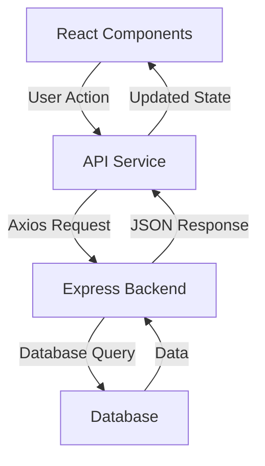

# Task Management App Documentation

## Project Structure Overview
This is a full-stack application with:
- Frontend: React (client-side)
- Backend: Express (server-side)
- HTTP Client: Axios
- Database: (not shown in the code, but typically MongoDB/PostgreSQL)

## Component Breakdown

### 1. API Service (api.js)
```javascript
import axios from 'axios';
const API_URL = 'http://localhost:5000/api';
```

The API service handles all HTTP requests using Axios:
- GET /tasks - Fetch all tasks
- POST /tasks - Create new task
- PUT /tasks/:id - Update task
- DELETE /tasks/:id - Remove task

### 2. Task List Component (TaskList.js)
Main features:
- State management using `useState`
- Side effects with `useEffect`
- Task completion toggle
- Task deletion
- List rendering

### 3. Task Form Component (TaskForm.js)
Features:
- New task creation
- Form state management
- Input handling
- Form submission

## Data Flow



## Request Flow Examples

### Adding a New Task
1. User enters task in TaskForm
2. Form submits to `taskService.createTask()`
3. Axios sends POST request
4. Express backend processes request
5. Database saves task
6. Response returns to frontend
7. UI updates

### Fetching Tasks
1. Component mounts
2. `useEffect` calls `fetchTasks()`
3. Axios sends GET request
4. Express queries database
5. Data returns to frontend
6. React updates state
7. UI renders tasks

## Technology Roles

### React (Frontend)
- Manages UI state
- Handles user interactions
- Renders components
- Makes API calls

### Axios (HTTP Client)
- Sends HTTP requests
- Handles responses
- Manages request headers
- Handles errors

### Express (Backend)
- Receives HTTP requests
- Processes data
- Interacts with database
- Sends responses

## CSS Architecture

The app uses CSS Modules for styling:
- Scoped to components
- Prevents style conflicts
- Modular and maintainable
- Easy to modify individual components

### CSS Examples
```css
.taskItem {
  display: flex;
  padding: 0.8rem;
  margin: 0.5rem 0;
  background: #f8f9fa;
  border-radius: 4px;
}

.button {
  background: #0d6efd;
  color: white;
  padding: 0.8rem 1.5rem;
  border-radius: 4px;
}
```

## Getting Started

1. Install dependencies:
```bash
npm install axios react-scripts
```

2. Start development server:
```bash
npm start
```

3. Backend server should run on port 5000

## Common Issues

1. Axios "Module not found":
   - Run `npm install axios`
   - Check import statement

2. CORS errors:
   - Add CORS middleware to Express
   - Check API_URL configuration

3. Database connection:
   - Verify connection string
   - Check database service status

## Best Practices

1. Error Handling
   - Always use try/catch
   - Display user-friendly errors
   - Log errors properly

2. State Management
   - Use appropriate React hooks
   - Keep state updates immutable
   - Implement loading states

3. Code Organization
   - Separate concerns
   - Use consistent naming
   - Document complex logic

## Further Resources

- [React Documentation](https://reactjs.org)
- [Axios Documentation](https://axios-http.com)
- [Express Documentation](https://expressjs.com)
- [CSS Modules](https://github.com/css-modules/css-modules)